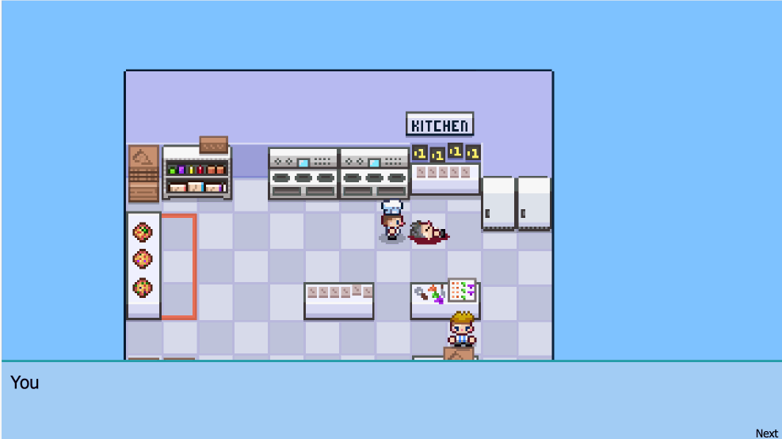

# Pizza ... a murder mystery game!

td;dr You can play the game here: https://pizza-mystery.netlify.app

Use the 'arrow keys' to move your character around the screen and hit 'return' to talk to the other people.

## But why?

I was really intrigued to see how games were animated using a simple game-loop, so I decided to follow a tutorial 
on just this topic. Using HTML, CSS and JavaScript, I coded-along until I reached the point where I'd satisfied my curiosity, 
then made a bunch of modifications to convert a turn-based pizza battle into a murder mystery game.

The tutorial was created by Drew Conley and he does a great job in explaining the process. Thankfully, he made the sprite-sheets available 
as I'm not the most artistic person in the world (it took me most of an afternoon just to add the victim's sprite!).

As someone who's kids are frequently immersed in these types of games, it was fun to see what goes on under the hood. 
My understanding of class-based structures in JavaScript and CSS certainly improved over the course of this build, and a few people 
have told me that they had fun playing the game - so it's all good!!

The end product looked like this:

If you'd like to follow the tutorial yourself, you can find it here: https://www.youtube.com/watch?v=fyi4vfbKEeo&amp;list=PLcjhmZ8oLT0r9dSiIK6RB_PuBWlG1KSq_&amp;index=1&amp;t=104s

